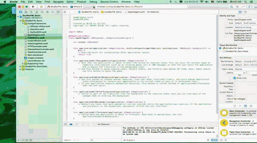

# DouBanFM_Demo
*仿豆瓣音乐播放器 (Swift 1.2 Xcode6.3) 根据[老镇讲堂编写](http://www.hcxy.me/course/28)仅供学习*
***

### 本程序代码较为简单具体功能实现可见如下视频(视频位于Resource目录下面)

<video id="video" controls="" preload="none" poster="http://media.w3.org/2010/05/sintel/poster.png">
      <source id="mp4" src="http://media.w3.org/2010/05/sintel/trailer.mp4" type="video/mp4">
      <source id="webm" src="http://media.w3.org/2010/05/sintel/trailer.webm" type="video/webm">
      <source id="ogv" src="http://media.w3.org/2010/05/sintel/trailer.ogv" type="video/ogg">
      
Your user agent does not support the HTML5 Video element.

    </video>
